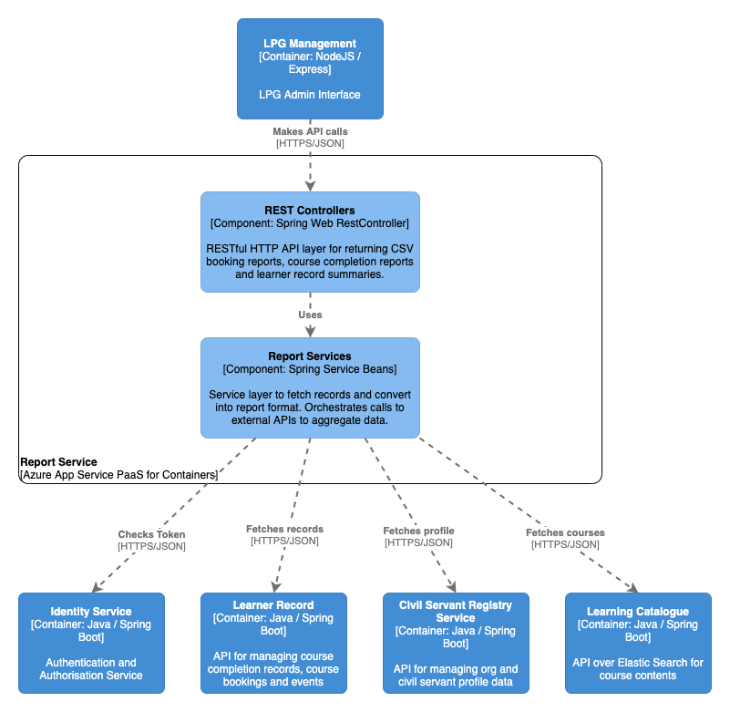

# Report Service

## Purpose

Spring Boot based RESTful API for generating CSV reports for modules completed, bookings made and learner record summaries. Report Service is called by the management site, acts as a client of CSRS, learner record and learning catalogue, aggregating the three data sources together into an extract for admin users.

## Component overview

See the `diagram/` folder for diagram source in draw.io XML format

## Dependencies

### Build-time

For a complete list of build dependencies check the `build.gradle` file. The main source dependencies are:  
- Spring Boot 2.0 (web, jersey, security, config)
- Spring Data JPA 2.0.5
- Spring Security OAuth2 2.3.3
- h2 database (in-memory DB for local development) 1.4
- opencsv 4.1

### Test-time

For a complete list of test dependencies check the `build.gradle` file. The main test dependencies are:  
- Spring Boot Starter Test
- Spring Boot Security Test
- mockito 2.8
- powermock 1.7

### Runtime 

#### Other LPG Services

- `identity-service` for OAuth token validation on all requests
- `learner-record` for retrieving learner record data on bookings and course completion
- `civil-servant-registry-service` for getting civil servant user profile data
- `learning-catalogue` for fetching the course details for completed courses

#### External integrations

- none

#### Data Stores

- none

#### Data migrations

- none

## Build, run, test, deploy

The application requires Java 8 (OpenJDK 8) installed to build and run.

Build the application using Gradle `./gradlew build`.

Run the project with `./gradlew bootRun` or import the project into your IDE of choice such as IntelliJ or VS Code use the IDE commands to Run Application.

Test using `./gradlew test` or choose individual test classes or packages using your IDE.

The application is packaged as a docker container image and includes an Azure App Insights Java agent for collecting metrics from the app - see `Dockerfile` in the root directory for the container definition. `hammer` is the log collector used for aggregating log output.

The application also inclues a `Jenkinsfile` to define the Jenkins build pipeline stages and linking it to the docker image repository and correct terraform module.

Deployment is controlled via the Terraform scripts in the main PaaS repository, with per-environment configuration values referenced there and secrets injected from keybase.

## Configuration

Significant configuration properties are highlighted here. For the full configuration file see `src/main/resources/application.yml`

- `oauth` connection settings for the identity-service used to validate bearer tokens
- `learnerRecord` connection settings and paths for the learner-record service
- `learningCatalogue` connection settings and paths for the learning-catalogue service
- `registryService` connection settings for the civil-servant-registry-service

## Licenses

Report Service is licensed by the MIT license, see `LICENSE` in the root folder for details. Dependent applications are licensed as according to their respective readme and license files.

